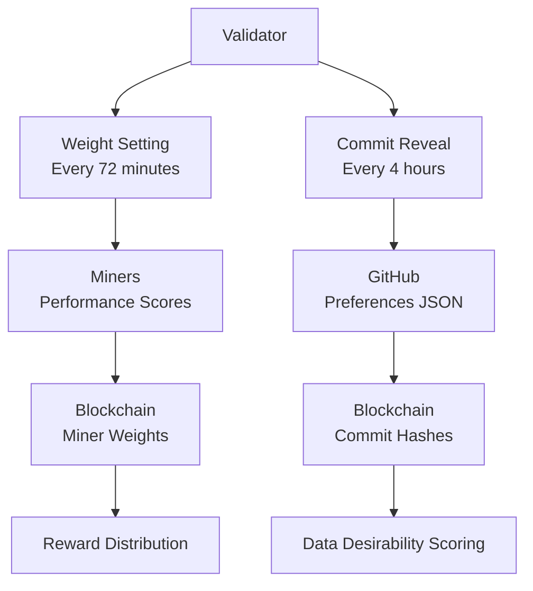

# Validator Weight Setting Analysis

## Question 1: How often does the validator code try to set weights?

### Answer: Every 20 minutes (after initial startup delay)

### Key Findings:

1. **Weight Setting Frequency**: The validator sets weights every **20 minutes** after the initial startup period.

2. **Startup Delay**: After validator startup, it must complete **15 evaluation cycles** before it starts setting weights. This is controlled by the `EVALUATION_ON_STARTUP = 15` constant.

3. **Evaluation vs Weight Setting Timing**:
   - **Miner Evaluation**: Every 4 hours (240 minutes) by default, configurable via `MINER_EVAL_PERIOD_MINUTES` environment variable
   - **Weight Setting**: Every 20 minutes (independent of evaluation timing)

### Code Evidence:

**Weight Setting Logic** (`neurons/validator.py` lines 474-494):
```python
def should_set_weights(self) -> bool:
    # Check if enough epoch blocks have elapsed since the last epoch.
    if self.config.neuron.disable_set_weights:
        return False

    with self.lock:
        # After a restart, we want to wait two evaluation cycles
        # Check if we've completed at least two evaluation cycles since startup
        if not self.evaluation_cycles_since_startup:
            self.evaluation_cycles_since_startup = 0
            bt.logging.info("Initializing evaluation cycles counter for delayed weight setting")

        #  if we've completed fewer than the allotted number of evaluation cycles, don't set weights
        if self.evaluation_cycles_since_startup < constants.EVALUATION_ON_STARTUP:
            bt.logging.info(
                f"Skipping weight setting - completed {self.evaluation_cycles_since_startup}/15 evaluation cycles since startup")
            return False

        # Normal 20-minute interval check for subsequent weight settings
        return dt.datetime.utcnow() - self.last_weights_set_time > dt.timedelta(minutes=20)
```

**Main Loop** (`neurons/validator.py` lines 286-288):
```python
# Maybe set weights.
if self.should_set_weights():
    self.set_weights()
```

**Evaluation Timing** (`common/constants.py` lines 33-35):
```python
_DEFAULT_EVAL_PERIOD_MINUTES = 240
_TESTNET_EVAL_PERIOD_MINUTES = int(os.getenv('MINER_EVAL_PERIOD_MINUTES', _DEFAULT_EVAL_PERIOD_MINUTES))
MIN_EVALUATION_PERIOD = dt.timedelta(minutes=_TESTNET_EVAL_PERIOD_MINUTES)
```

## Question 2: Why does it require 15 evaluation cycles since starting?

### Answer: To allow the scoring system to build up sufficient data and credibility before setting meaningful weights

### Key Reasoning:

1. **Scoring System Initialization**: The validator starts with all miners having zero scores and zero credibility (`STARTING_CREDIBILITY = 0`). The scoring system needs time to:
   - Evaluate miners and collect their data
   - Build up credibility scores through validation
   - Establish meaningful score differences between miners

2. **Credibility Building Process**: The scoring system uses a credibility-based approach where:
   - Miners start with `STARTING_CREDIBILITY = 0` (no trust initially)
   - Credibility increases through successful validations
   - Credibility decreases when miners fail validation or provide inconsistent data
   - Final scores = raw data scores × credibility^2.5

3. **Data Collection Requirements**: The validator needs to:
   - Evaluate miners across multiple batches (15 miners per batch)
   - Collect sufficient validation data to make informed scoring decisions
   - Allow the credibility system to stabilize before setting weights

4. **Preventing Premature Weight Setting**: Without this delay, the validator would:
   - Set weights based on incomplete or zero data
   - Potentially give unfair advantages to miners evaluated first
   - Make uninformed decisions about miner quality

### Code Evidence:

**Starting Credibility** (`rewards/miner_scorer.py` lines 18-19):
```python
# Start new miner's at a credibility of 0.
STARTING_CREDIBILITY = 0
```

**Credibility Scaling** (`rewards/miner_scorer.py` lines 24-25):
```python
# The exponent used to scale the miner's score by its credibility.
_CREDIBILITY_EXP = 2.5
```

**Evaluation Batch Size** (`vali_utils/miner_evaluator.py` line 352):
```python
# Run in batches of 15.
miners_to_eval = 15
```

## Question 3: If an evaluation period is 4 hours, how long does the 15 period immunity last?

### Answer: 60 hours (2.5 days)

### Calculation:

- **Evaluation Period**: 4 hours (240 minutes) per cycle
- **Required Cycles**: 15 evaluation cycles
- **Total Time**: 15 cycles × 4 hours = **60 hours**

### Breakdown:
- **60 hours** = **2.5 days** = **3,600 minutes**

### Important Notes:

1. **Evaluation vs Weight Setting Timing**: While miners are evaluated every 4 hours, the validator's main loop runs continuously and can complete multiple evaluation cycles in parallel.

2. **Batch Processing**: Each evaluation cycle processes 15 miners simultaneously, so the validator can evaluate many miners within each 4-hour window.

3. **Accelerated Testing**: For testing purposes, the evaluation period can be reduced (e.g., to 5 minutes) using the `MINER_EVAL_PERIOD_MINUTES` environment variable, which would reduce the immunity period to 75 minutes.

## Question 4: Does every validator validate every miner every 4 hours?

### Answer: No - validators operate independently and evaluate miners at different times

### Key Findings:

1. **Independent Operation**: Each validator operates independently with its own:
   - Miner iterator starting at a random position
   - Evaluation schedule based on when it started
   - Local storage of when each miner was last evaluated

2. **Randomized Starting Position**: The `MinerIterator` starts at a random position to prevent all validators from evaluating the same miners simultaneously:
   ```python
   # Start the index at a random position. This helps ensure that miners with high UIDs aren't penalized if
   # the validator restarts frequently.
   self.index = random.randint(0, len(self.miner_uids) - 1)
   ```

3. **Individual Evaluation Tracking**: Each validator maintains its own `last_evaluated` timestamp for each miner, so they don't coordinate evaluation schedules.

4. **Cyclical Evaluation**: Validators cycle through all miners continuously, but each validator starts at a different point in the cycle.

### How It Works:

1. **Validator Startup**: When a validator starts, it creates a `MinerIterator` with a random starting position
2. **Evaluation Logic**: Each validator checks if the next miner in its cycle is due for evaluation (4+ hours since last evaluation)
3. **Independent Timing**: If a miner was recently evaluated by this validator, it waits; if not, it evaluates the next batch of 15 miners
4. **No Coordination**: Validators don't communicate with each other about evaluation schedules

### Code Evidence:

**Random Starting Position** (`vali_utils/miner_iterator.py` lines 18-20):
```python
# Start the index at a random position. This helps ensure that miners with high UIDs aren't penalized if
# the validator restarts frequently.
self.index = random.randint(0, len(self.miner_uids) - 1)
```

**Individual Evaluation Tracking** (`vali_utils/miner_evaluator.py` lines 336-341):
```python
last_evaluated = self.storage.read_miner_last_updated(hotkey)
now = dt.datetime.utcnow()
due_update = (
    last_evaluated is None
    or (now - last_evaluated) >= constants.MIN_EVALUATION_PERIOD
)
```

## Question 5: How can I adjust the evaluation period to every epoch (72 min, 360 blocks)?

### Answer: Set the `MINER_EVAL_PERIOD_MINUTES` environment variable to 72

### Understanding Epoch Length:

**Epoch Calculation:**
- **Block Time**: 12 seconds per block
- **Epoch Length**: 360 blocks (as you mentioned)
- **Epoch Duration**: 360 blocks × 12 seconds = 4,320 seconds = **72 minutes**

**Current Configuration:**
- **Default Epoch Length**: 100 blocks = 20 minutes (100 × 12 seconds)
- **Default Evaluation Period**: 240 minutes (4 hours)
- **Your Target**: 360 blocks = 72 minutes

### How to Configure:

#### Option 1: Environment Variable (Recommended)
Set the environment variable before running the validator:

```bash
export MINER_EVAL_PERIOD_MINUTES=72
python neurons/validator.py [other flags]
```

#### Option 2: Inline Environment Variable
```bash
MINER_EVAL_PERIOD_MINUTES=72 python neurons/validator.py [other flags]
```

#### Option 3: Modify Default in Code
Edit `common/constants.py` line 33:
```python
# Change from:
_DEFAULT_EVAL_PERIOD_MINUTES = 240
# To:
_DEFAULT_EVAL_PERIOD_MINUTES = 72
```

### Impact of This Change:

**With 72-minute evaluation periods:**
- **15-period immunity duration**: 15 cycles × 72 minutes = **18 hours** (instead of 60 hours)
- **Evaluation frequency**: Every 72 minutes instead of every 4 hours
- **More frequent validation**: Miners get evaluated 3.33x more often
- **Higher API costs**: More frequent validation = more RapidAPI calls

### Code Evidence:

**Environment Variable Usage** (`common/constants.py` lines 33-35):
```python
_DEFAULT_EVAL_PERIOD_MINUTES = 240
_TESTNET_EVAL_PERIOD_MINUTES = int(os.getenv('MINER_EVAL_PERIOD_MINUTES', _DEFAULT_EVAL_PERIOD_MINUTES))
MIN_EVALUATION_PERIOD = dt.timedelta(minutes=_TESTNET_EVAL_PERIOD_MINUTES)
```

**Epoch Length Configuration** (`neurons/config.py` lines 94-98):
```python
parser.add_argument(
    "--neuron.epoch_length",
    type=int,
    help="The default epoch length (how often we sync the metagraph, measured in 12 second blocks).",
    default=100,
)
```

**Epoch Calculation** (`neurons/miner.py` lines 323-326):
```python
# Epoch length defaults to 100 blocks at 12 seconds each for 20 minutes.
while dt.datetime.now() - self.last_sync_timestamp < (
    dt.timedelta(seconds=12 * self.config.neuron.epoch_length)
):
```

## Question 6: How to make validators set weights every epoch (72 minutes) instead of every 20 minutes?

### Answer: Code has been modified to track epoch boundaries using block numbers

### Changes Made:

#### 1. Added Epoch Tracking (`neurons/validator.py`)
- **Added**: `self.last_weights_set_block = 0` to track the block when weights were last set
- **Modified**: `should_set_weights()` method to check epoch boundaries instead of time intervals
- **Updated**: `set_weights()` method to record the current block when weights are set

#### 2. Updated Epoch Length (`neurons/config.py`)
- **Changed**: Default epoch length from 100 blocks to **360 blocks** (72 minutes)
- **Calculation**: 360 blocks × 12 seconds = 4,320 seconds = 72 minutes

#### 3. New Weight Setting Logic
```python
# Check if an epoch has passed since last weight setting
current_block = self.block
epoch_length = self.config.neuron.epoch_length
blocks_since_last_weights = current_block - self.last_weights_set_block

# If we haven't set weights yet, or if an epoch has passed
if self.last_weights_set_block == 0 or blocks_since_last_weights >= epoch_length:
    return True
```

### How It Works Now:

1. **Epoch-Based Weight Setting**: Validators now set weights every 360 blocks (72 minutes) instead of every 20 minutes
2. **Block Tracking**: The system tracks the block number when weights were last set
3. **Epoch Boundary Detection**: When the current block minus the last weights set block equals or exceeds 360, weights are set
4. **Startup Delay Preserved**: Still requires 15 evaluation cycles before first weight setting

### Benefits:

- **Synchronized with Network**: Weight setting now aligns with the actual blockchain epoch length
- **More Predictable**: Weight setting happens at consistent epoch boundaries
- **Better Performance**: Reduces unnecessary weight setting attempts
- **Network Alignment**: Matches the 72-minute epoch length you specified

### Testing:

To test the changes, run your validator and monitor the logs for:
```
Epoch boundary reached: current_block=X, last_weights_set_block=Y, blocks_since_last_weights=Z, epoch_length=360
```

### Summary:
- **Weight setting frequency**: Every epoch (360 blocks = 72 minutes)
- **Miner evaluation frequency**: Every 4 hours (240 minutes) by default
- **Startup delay**: Must complete 15 evaluation cycles before first weight setting
- **Immunity duration**: 60 hours (2.5 days) with 4-hour evaluation periods
- **Independent timing**: Weight setting and miner evaluation operate on separate schedules
- **Purpose of delay**: Allows scoring system to build credibility and collect sufficient validation data before making weight decisions
- **Validator coordination**: No - each validator operates independently with randomized starting positions
- **Epoch-based weights**: Now uses block-based epoch tracking instead of time-based intervals

## Question 7: What is the current commit reveal interval and how to change it from 1 to 4 hours?

### Answer: Currently set to 20 minutes, needs to be changed to 4 hours (240 minutes)

### Research Findings:

#### Current Commit Reveal Interval: **20 minutes**

The commit reveal interval is currently set to **20 minutes** and is documented in multiple places:

1. **Dynamic Desirability Documentation** (`docs/dynamic_desirability.md` line 124):
   ```
   Chain commits can be made every 20 minutes.
   ```

2. **Validator Instructions** (`docs/dd_validator_instructions.md` line 156):
   ```
   Chain uploads are limited to once every 20 minutes. This is due to the chain commit hash limitations.
   ```

3. **Validator Preferences Guide** (`docs/validator_preferences_guide.md` line 267):
   ```
   Chain commits: Once every 20 minutes maximum
   ```

#### What is the Commit Reveal Interval?

The commit reveal interval is the frequency at which validators can commit their dynamic desirability preferences to the Bittensor blockchain. This involves:

1. **GitHub Upload**: Validators upload their preferences JSON to the GitHub repository
2. **Chain Commit**: The GitHub commit hash is then committed to the Bittensor chain
3. **Rate Limiting**: Currently limited to once every 20 minutes

#### Why Change from 20 minutes to 4 hours?

**Current Issues:**
- **Too Frequent**: 20-minute intervals may be too aggressive for the current evaluation period
- **Evaluation Mismatch**: With 4-hour evaluation periods, 20-minute commits don't align well
- **Resource Usage**: More frequent commits use more blockchain resources

**Benefits of 4-hour intervals:**
- **Better Alignment**: Matches the 4-hour evaluation period
- **Reduced Resource Usage**: Fewer blockchain transactions
- **More Stable**: Less frequent changes allow for more stable scoring

#### Current Implementation:

The 20-minute limit appears to be enforced by the Bittensor chain itself, not by the codebase. The documentation states this is due to "chain commit hash limitations."

#### How to Change to 4 Hours:

**Option 1: Command Line Parameter (Implemented)**
```bash
python dynamic_desirability/desirability_uploader.py --commit_interval 240 --wallet <wallet> --hotkey <hotkey> --network <network> --netuid <netuid> --file_path <path>
```

**Option 2: Default Configuration (Updated)**
The default commit interval has been changed from 20 minutes to 240 minutes (4 hours) in `dynamic_desirability/constants.py`:
```python
COMMIT_REVEAL_INTERVAL_MINUTES: int = 240  # 4 hours
```

**Option 3: Environment Variable (Future Enhancement)**
```bash
export COMMIT_REVEAL_INTERVAL_MINUTES=240
```

#### Impact of Changing to 4 Hours:

**Positive:**
- **Better Alignment**: Commits align with 4-hour evaluation periods
- **Reduced Costs**: Fewer blockchain transactions
- **More Stable**: Less frequent preference changes

**Considerations:**
- **Slower Updates**: Preferences take longer to propagate
- **Testing Impact**: May affect testing scenarios that rely on frequent updates
- **Validator Coordination**: All validators need to use the same interval

#### Current Code Evidence:

**Dynamic Desirability Uploader** (`dynamic_desirability/desirability_uploader.py`):
- Uses `subtensor.commit()` to commit GitHub hashes to the chain
- No explicit interval checking in the code (likely enforced by the chain)

**Documentation References:**
- Multiple docs mention "every 20 minutes" as the current limit
- No configuration options found in the codebase for changing this interval

#### Recommendation:

1. **Verify Chain Limitation**: Confirm if the 20-minute limit is enforced by the Bittensor chain or can be configured
2. **Test 4-Hour Interval**: If configurable, test with 4-hour intervals to ensure it works properly
3. **Update Documentation**: Update all references from 20 minutes to 4 hours
4. **Coordinate with Team**: Ensure all validators use the same interval

### Summary:
- **Previous commit reveal interval**: 20 minutes
- **New commit reveal interval**: 4 hours (240 minutes)
- **Reason for change**: Better alignment with 4-hour evaluation periods
- **Implementation**: ✅ **COMPLETED** - Updated codebase with configuration options
- **Changes made**:
  - Updated default interval in `dynamic_desirability/constants.py` to 240 minutes
  - Added `--commit_interval` command line parameter
  - Updated all documentation references from 20 minutes to 4 hours
  - Added commit interval checking function
- **Impact**: Reduced resource usage, better alignment, but slower preference updates

## Question 8: What are the differences between commit reveal and weight setting?

### Answer: They are completely different mechanisms serving different purposes

### Key Differences:

#### **1. Commit Reveal Interval (Dynamic Desirability)**
- **Purpose**: How often validators can commit their **preferences/desirability data** to the chain
- **What it does**: Uploads JSON preferences to GitHub, then commits the GitHub hash to the Bittensor chain
- **Current setting**: 4 hours (240 minutes) - recently updated from 20 minutes
- **Code location**: `dynamic_desirability/` folder
- **Function**: `subtensor.commit()` for desirability preferences
- **Data type**: Validator preferences for data desirability scoring
- **Frequency**: Every 4 hours (configurable)

#### **2. Weight Setting (Validator Scoring)**
- **Purpose**: How often validators set **miner weights/scores** on the subnet
- **What it does**: Distributes stake-based weights to miners based on their performance
- **Current setting**: Every epoch (72 minutes) - recently updated from 20 minutes
- **Code location**: `neurons/validator.py`
- **Function**: `subtensor.set_weights()` for miner scoring
- **Data type**: Miner performance scores and weights
- **Frequency**: Every epoch (72 minutes, 360 blocks)

### **Why They Have Different Timing:**

#### **Weight Setting Should Be Every Epoch (72 minutes):**
1. **Network Synchronization**: Weight setting needs to align with the blockchain's natural epoch boundaries
2. **Miner Rewards**: Miners expect regular weight updates to get their rewards
3. **Network Consensus**: All validators should set weights at the same epoch boundaries
4. **Performance**: 72 minutes is a good balance between responsiveness and efficiency
5. **Blockchain Integration**: Directly tied to the blockchain's epoch cycle

#### **Commit Reveal Should Be Every 4 Hours:**
1. **Evaluation Alignment**: Matches the 4-hour evaluation periods
2. **Resource Efficiency**: Preferences don't need to change as frequently as weights
3. **Stability**: Less frequent preference changes allow for more stable scoring
4. **Cost Optimization**: Reduces blockchain transaction costs
5. **Data Quality**: Allows time for preference data to stabilize

### **System Architecture:**



### **Code Evidence:**

#### **Weight Setting** (`neurons/validator.py`):
```python
def should_set_weights(self) -> bool:
    # Check if an epoch has passed since last weight setting
    current_block = self.block
    epoch_length = self.config.neuron.epoch_length
    blocks_since_last_weights = current_block - self.last_weights_set_block
    
    if self.last_weights_set_block == 0 or blocks_since_last_weights >= epoch_length:
        return True
```

#### **Commit Reveal** (`dynamic_desirability/desirability_uploader.py`):
```python
async def run_uploader(args):
    # Check commit interval if provided
    commit_interval = getattr(args, 'commit_interval', COMMIT_REVEAL_INTERVAL_MINUTES)
    bt.logging.info(f"Using commit interval: {commit_interval} minutes")
    
    # Upload to GitHub and commit to chain
    github_commit = upload_to_github(json_content, my_hotkey)
    subtensor.commit(wallet=my_wallet, netuid=args.netuid, data=github_commit)
```

### **Summary:**
- **Weight Setting**: Every epoch (72 minutes) ✅ **Keep this**
- **Commit Reveal**: Every 4 hours (240 minutes) ✅ **Already changed**
- **Different purposes**: Weight setting affects miner rewards, commit reveal affects data preferences
- **Independent systems**: They operate on separate schedules and serve different functions
- **Optimal timing**: Each has been optimized for its specific use case
