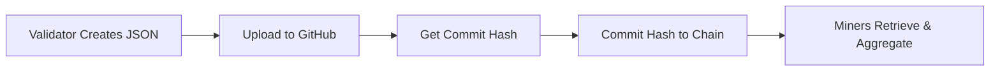

# 🏠 Subnet 46 Validator Guide: Real Estate Data Preferences

## 📋 Table of Contents
- [What is Dynamic Desirability?](#what-is-dynamic-desirability)
- [Why Should Validators Participate?](#why-should-validators-participate)
- [How the System Works](#how-the-system-works)
- [Getting Started](#getting-started)
- [Submitting Your Preferences](#submitting-your-preferences)
- [JSON Format Requirements](#json-format-requirements)
- [Security & Authentication](#security--authentication)
- [Voting Power & Impact](#voting-power--impact)
- [Troubleshooting](#troubleshooting)

---

## 🎯 What is Dynamic Desirability?

**Dynamic Desirability** is a democratic voting system that allows validators to influence which real estate data gets prioritized and rewarded on Subnet 46. Instead of relying solely on fixed default preferences, validators can submit their own preferences to shape the network's data collection priorities.

### Key Benefits:
- **🗳️ Democratic Control**: Validators vote on data priorities based on their stake
- **📈 Market Responsiveness**: Adapt to changing real estate market conditions
- **💰 Reward Optimization**: Direct miners toward high-value data collection
- **🏆 Competitive Advantage**: Early participants get disproportionate influence

---

## 🚀 Why Should Validators Participate?

### **1. Maximize Your Mining Rewards**
By setting preferences that align with market demand, you can:
- Guide miners to collect data from high-value zip codes
- Prioritize property types with strong market activity
- Focus on time-sensitive opportunities (new listings, price changes)

### **2. Gain Disproportionate Influence**
The system rewards early adoption:
- **70% of total voting power** goes to participating validators
- **30% remains with subnet operator** (default preferences)
- If only a few validators participate, each gets a larger share of the 70%

**Example**: If you have 10% network stake and you're the only validator participating:
- You control **70% of all data preferences** (the entire validator allocation)
- Your influence is 7x your actual stake percentage!

### **3. Shape Network Evolution**
Help determine:
- Which geographic markets get priority
- What property data types are most valuable
- How the network adapts to market conditions

---

## ⚙️ How the System Works

The process involves **both GitHub and Bittensor chain** for security:



### **Why Both GitHub AND Chain?**

1. **🔐 Security**: Chain commits prove authenticity (only you can commit to your validator UID)
2. **⚡ Efficiency**: GitHub provides fast file hosting, chain stores lightweight hashes
3. **🎯 Stake Weighting**: System knows your actual stake for proper vote weighting
4. **📊 Transparency**: Full audit trail of who voted for what and when

---

## 🛠️ Getting Started

### **Step 1: Request GitHub Write Access**

You **must be added as a collaborator** to the [Prospector Repository](https://github.com/resi-labs-ai/prospector) to submit preferences.

**Contact the subnet operator** with:
- Your validator hotkey address
- Your GitHub username
- Brief explanation of your validation setup

### **Step 2: Understand Current Defaults**

The network currently prioritizes:
- **Premium zip codes**: High-value markets (weight: 4.0)
- **Major metro areas**: Large population centers (weight: 2.4-3.0)  
- **Standard markets**: Mid-tier areas (weight: 1.8-2.0)
- **Rural areas**: Lower priority (weight: 1.2-1.5)

View current defaults: [`validator_preferences/default.json`](https://github.com/resi-labs-ai/prospector/blob/main/validator_preferences/default.json)

---

## 📝 Submitting Your Preferences

### **Method 1: Command Line (Recommended)**

1. **Create your preferences JSON file** (see format below)
2. **Run the uploader script**:

```bash
python dynamic_desirability/desirability_uploader.py \
    --wallet YOUR_WALLET_NAME \
    --hotkey YOUR_HOTKEY_NAME \
    --network finney \
    --netuid 46 \
    --file_path my_preferences.json
```

### **Method 2: Validator API**

If your validator exposes the API, you can submit via HTTP:

```bash
curl -X POST http://your-validator:8000/set_desirabilities \
     -H "Content-Type: application/json" \
     -d @my_preferences.json
```

### **What Happens During Submission:**

1. **Validation**: System checks JSON format and constraints
2. **GitHub Upload**: Creates `validator_preferences/{your_hotkey}.json`
3. **Chain Commit**: Stores the GitHub commit hash on-chain
4. **Confirmation**: Returns success message with commit hash

---

## 📋 JSON Format Requirements

### **Basic Structure:**
```json
[
    {
        "id": "unique_identifier",
        "weight": 0.4,
        "params": {
            "keyword": null,
            "platform": "rapid_zillow",
            "label": "zip:77494",
            "post_start_datetime": null,
            "post_end_datetime": null
        }
    }
]
```

### **Real Estate Example:**
```json
[
    {
        "id": "premium_houston_forsale",
        "weight": 0.3,
        "params": {
            "keyword": null,
            "platform": "rapid_zillow",
            "label": "zip:77494",
            "post_start_datetime": null,
            "post_end_datetime": null
        }
    },
    {
        "id": "luxury_miami_forrent", 
        "weight": 0.3,
        "params": {
            "keyword": null,
            "platform": "rapid_zillow",
            "label": "zip:33139",
            "post_start_datetime": null,
            "post_end_datetime": null
        }
    },
    {
        "id": "new_york_condos",
        "weight": 0.4,
        "params": {
            "keyword": null,
            "platform": "rapid_zillow", 
            "label": "zip:10001",
            "post_start_datetime": null,
            "post_end_datetime": null
        }
    }
]
```

### **Validation Rules:**
- ✅ **Weights**: Must be between 0.1 and 1.0
- ✅ **Total Weight**: All weights must sum to ≤ 1.0
- ✅ **Platform**: Must be `"rapid_zillow"`
- ✅ **Labels**: Must start with `"zip:"` followed by valid US zip code
- ✅ **Unique IDs**: Each job needs a unique identifier

### **Common Label Formats:**
- **Zip Codes**: `"zip:90210"`, `"zip:10001"`, `"zip:33139"`
- **Status Filters**: `"status:forsale"`, `"status:forrent"`
- **Property Types**: `"type:condo"`, `"type:house"`, `"type:apartment"`

---

## 🔒 Security & Authentication

### **Why Chain Commitment is Required:**

Without chain commits, the system would be vulnerable to:
- **Sybil Attacks**: Fake validators submitting preferences  
- **Impersonation**: Bad actors submitting on behalf of real validators
- **Gaming**: Coordinated manipulation of data priorities

### **How Authentication Works:**

1. **Private Key Proof**: Only you can commit to your validator UID
2. **Stake Verification**: System reads your actual stake from the chain
3. **Immutable Record**: Chain creates permanent audit trail
4. **Hash Verification**: GitHub commits must match chain hashes

---

## 🗳️ Voting Power & Impact

### **Voting Power Distribution:**
- **70% Total**: Allocated to all participating validators
- **30% Default**: Remains with subnet operator defaults
- **Stake-Weighted**: Your share = (Your Stake / Total Participating Stake) × 70%

### **Example Scenarios:**

**Scenario 1: You're the only validator participating**
- Your stake: 10% of network
- Your voting power: **70%** (entire validator allocation)
- Your influence: **7x your stake percentage**

**Scenario 2: Three validators participating**
- Validator A: 10% stake → 17.5% voting power
- Validator B: 15% stake → 26.25% voting power  
- Validator C: 5% stake → 8.75% voting power
- Remaining: 17.5% goes to defaults

### **Maximum Impact:**
- Single validator max influence: **70%** of total network preferences
- Early entry heavily incentivized
- Late entry still valuable but diluted

---

## 🔧 Troubleshooting

### **Common Issues:**

**❌ "No write access to repository"**
- Solution: Contact subnet operator to add you as collaborator

**❌ "JSON validation failed"**
- Solution: Check weight sums, valid zip codes, correct platform name

**❌ "Chain commit failed"**
- Solution: Ensure wallet has sufficient balance for transaction fees

**❌ "Commit hash mismatch"**
- Solution: Wait for GitHub sync, then retry

### **Rate Limits:**
- **Chain commits**: Once every 20 minutes maximum
- **GitHub pushes**: No specific limit, but avoid spam

### **Verification:**

Check if your preferences were accepted:
```bash
python dynamic_desirability/desirability_retrieval.py \
    --wallet YOUR_WALLET \
    --hotkey YOUR_HOTKEY \
    --network finney \
    --netuid 46
```

---

## 📞 Support

For questions about Subnet 46 validator preferences:

- **GitHub Issues**: [resi-labs-ai/46-resi-labs-data-universe](https://github.com/resi-labs-ai/46-resi-labs-data-universe/issues)
- **Bittensor Discord**: Subnet 46 channel
- **Documentation**: [Full Validator Docs](./docs/dd_validator_instructions.md)

---

## 🎯 Quick Start Checklist

- [ ] Request GitHub write access to Prospector repo
- [ ] Study current default preferences
- [ ] Create your preferences JSON file
- [ ] Test JSON format validity
- [ ] Run uploader script with your preferences
- [ ] Verify chain commit success
- [ ] Monitor your preferences' impact on network data

**Ready to shape the future of real estate data collection? Start submitting your preferences today!** 🚀
