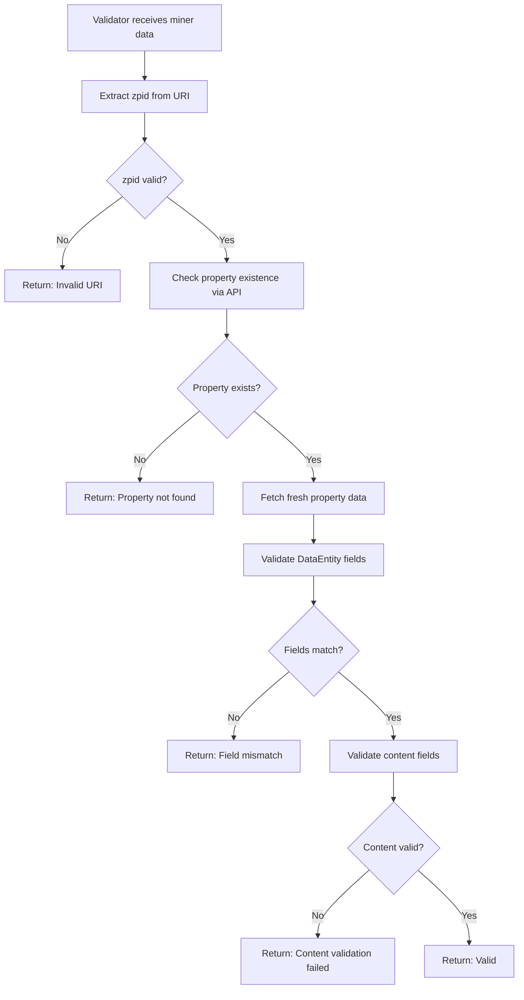

# Zillow Data Validation Guide

## Overview

This document describes the validation system for Zillow real estate data in the Bittensor Data Universe subnet. The validation system has been specifically designed to handle the unique challenges of real estate data validation while maintaining compatibility with the existing Twitter/Reddit validation framework.

## Validation Architecture

### Three-Tier Validation System

1. **Property Existence Check**: Verifies the property still exists via Zillow API
2. **DataEntity Field Validation**: Validates core entity fields with timestamp tolerance
3. **Content Field Validation**: Validates real estate-specific fields with appropriate tolerances

### Key Components

- **ZillowRapidAPIScraper**: Enhanced scraper with comprehensive validation
- **validate_zillow_data_entity_fields()**: Main validation function with timestamp handling
- **validate_zillow_content_fields()**: Real estate-specific content validation
- **validate_time_sensitive_fields()**: Handles volatile market data

## Validation Process Flow



## Field Validation Rules

### Critical Fields (Exact Match Required)
- **zpid**: Zillow Property ID - must match exactly
- **address**: Property address - must match exactly  
- **property_type**: Property type (SINGLE_FAMILY, CONDO, etc.) - must match exactly

### Stable Fields (Exact Match When Present)
- **bedrooms**: Number of bedrooms
- **bathrooms**: Number of bathrooms
- **living_area**: Living area in square feet
- **latitude/longitude**: Property coordinates

### Time-Sensitive Fields (Tolerance Applied)
- **price**: ±5% tolerance for price changes
- **zestimate**: ±10% tolerance for estimate fluctuations
- **days_on_zillow**: ±7 days tolerance for market timing
- **listing_status**: Compatible status transitions allowed

### Ignored/Volatile Fields
- **scraped_at**: Timestamp differences handled automatically
- **img_src**: Image URLs may change frequently
- **carousel_photos**: Photo arrays may be updated

## Timestamp Handling

### The Problem
Unlike social media content, real estate data includes timestamps that change with each scraping operation. Traditional validation would fail due to exact datetime matching requirements.

### The Solution
The validation system uses **timestamp tolerance** by normalizing timestamps:

```python
# Uses miner's timestamp to avoid comparison issues
normalized_actual_entity = DataEntity(
    uri=actual_entity.uri,
    datetime=entity.datetime,  # Use miner's datetime
    source=actual_entity.source,
    label=actual_entity.label,
    content=actual_entity.content,
    content_size_bytes=actual_entity.content_size_bytes
)
```

## Tolerance Configurations

### Price Validation
- **Tolerance**: 5% of original price
- **Rationale**: Real estate prices can fluctuate due to market conditions, price reductions, or data provider updates
- **Example**: $465,000 property allows ±$23,250 variance

### Zestimate Validation  
- **Tolerance**: 10% of original estimate
- **Rationale**: Zestimates are algorithmic estimates that update frequently based on market data
- **Example**: $460,900 Zestimate allows ±$46,090 variance

### Days on Market
- **Tolerance**: ±7 days
- **Rationale**: Different scraping times may capture different "days on market" values
- **Example**: Property listed 15 days allows 8-22 day range

### Listing Status Transitions
Compatible status changes are allowed:
- `FOR_SALE` → `PENDING` or `SOLD`
- `FOR_RENT` → `RENTED`  
- `PENDING` → `SOLD` or `FOR_SALE` (deal fell through)

## Error Handling Strategy

### Graceful Degradation
The validation system uses a **fallback strategy** to avoid false negatives:

1. **Primary**: Full content validation with field comparison
2. **Fallback**: Property existence check only
3. **Exception**: Assume valid to avoid penalizing miners

### Rate Limiting Protection
- Automatic retry with exponential backoff
- Rate limit detection (HTTP 429)
- Graceful handling of API errors

## API Testing

### Test Property Existence
```bash
curl -X GET "https://zillow-com1.p.rapidapi.com/property?zpid=70982473" \
  -H "X-RapidAPI-Key: YOUR_API_KEY" \
  -H "X-RapidAPI-Host: zillow-com1.p.rapidapi.com"
```

### Expected Response Format
```json
{
  "property": {
    "zpid": "70982473",
    "address": "7622 R W Emerson Loop, Laredo, TX 78041",
    "propertyType": "SINGLE_FAMILY",
    "price": 465000,
    "listingStatus": "FOR_SALE",
    // ... additional fields
  }
}
```

## Validation Examples

### Successful Validation
```python
# Miner's data
miner_entity = DataEntity(
    uri="https://zillow.com/homedetails/property/70982473_zpid/",
    datetime=datetime(2025, 9, 11, 13, 12, 29),
    source=DataSource.RAPID_ZILLOW,
    content=property_content_bytes
)

# Validator's fresh data (3 minutes later)
validator_content = RealEstateContent(
    zpid="70982473",  # Same zpid ✓
    address="7622 R W Emerson Loop, Laredo, TX 78041",  # Same address ✓
    price=467000,  # ~0.4% increase (within 5% tolerance) ✓
    zestimate=462000,  # ~0.2% increase (within 10% tolerance) ✓
    days_on_zillow=16,  # 1 day increase (within 7-day tolerance) ✓
    scraped_at=datetime(2025, 9, 11, 13, 15, 45)  # Different timestamp (handled) ✓
)

# Result: VALID
```

### Failed Validation Examples

#### Critical Field Mismatch
```python
# Different zpid = immediate failure
validator_content.zpid = "12345678"  # ❌ Critical field mismatch
# Result: INVALID - "Critical field 'zpid' mismatch"
```

#### Price Change Too Large  
```python
# Price increase > 5% tolerance
validator_content.price = 490000  # ~5.4% increase ❌
# Result: INVALID - "Price difference too large: 5.4% (max 5%)"
```

#### Invalid Status Transition
```python
# Invalid status change
miner_content.listing_status = "FOR_SALE"
validator_content.listing_status = "FOR_RENT"  # ❌ Invalid transition
# Result: INVALID - "Incompatible listing status"
```

## Monitoring and Debugging

### Validation Metrics
The system logs detailed validation metrics:
- Validation success/failure rates by field type
- Common failure reasons
- API response times and error rates
- Property existence vs. content validation results

### Debug Logging
```python
# Enable debug logging for validation details
bt.logging.debug(f"Content validation passed for zpid {zpid}")
bt.logging.info(f"Content validation failed for zpid {zpid}: {result.reason}")
```

### Common Issues and Solutions

| Issue | Cause | Solution |
|-------|-------|----------|
| "Could not extract zpid from URI" | Invalid URI format | Ensure URI contains "/homedetails/" and ends with "_zpid/" |
| "Critical field mismatch" | Property data changed significantly | Check if property is still the same listing |
| "Price difference too large" | Market price changed > 5% | Verify price change is legitimate |
| "Property not found" | Property sold/removed | Normal - property no longer available |
| "Rate limited" | Too many API calls | Automatic retry with backoff |

## Configuration

### Environment Variables
```bash
RAPIDAPI_KEY=your_rapidapi_key_here
RAPIDAPI_HOST=zillow-com1.p.rapidapi.com
```

### Validation Tolerances
Tolerances can be adjusted in `scraping/zillow/utils.py`:

```python
# Price validation tolerance
price_diff_percent > 0.05  # 5% tolerance

# Zestimate validation tolerance  
zest_diff_percent > 0.10   # 10% tolerance

# Days on market tolerance
days_diff > 7              # 7-day tolerance
```

## Best Practices

### For Miners
1. **Consistent Labeling**: Use proper zip code format in labels (`zip:12345`)
2. **Accurate URIs**: Ensure URIs contain valid zpid format
3. **Fresh Data**: Scrape data as close to upload time as possible
4. **Error Handling**: Handle API errors gracefully during scraping

### For Validators  
1. **Rate Limiting**: Respect API rate limits to avoid service disruption
2. **Error Tolerance**: Allow for reasonable data variations in volatile fields
3. **Monitoring**: Track validation success rates and failure patterns
4. **Fallback Strategy**: Use existence checks when content validation fails

## Future Enhancements

### Planned Improvements
- **Machine Learning**: Predictive models for acceptable price variations
- **Market Context**: Integration with market trend data for smarter tolerances
- **Caching**: Property data caching to reduce API calls
- **Batch Validation**: Bulk property validation for efficiency

### Extensibility
The validation framework is designed to support additional real estate data sources:
- Redfin integration
- MLS data validation  
- Property history validation
- Neighborhood data validation

---

For technical implementation details, see the source code in:
- `scraping/zillow/utils.py` - Validation utilities
- `scraping/zillow/rapid_zillow_scraper.py` - Enhanced scraper
- `tests/scraping/zillow/` - Comprehensive test suite
